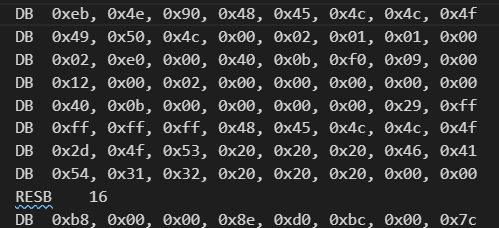
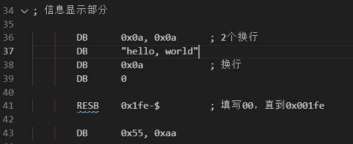

## TIME
{: id="20210306154304-nnoqx0b" updated="20210306165702"}

2021-03-06 15:52 - 2021-03-06 16:57
{: id="20210306165702-7x5d105" updated="20210309132741"}

## DB
{: id="20210306165656-cjsi2vy" updated="20210306165656"}

向文件中直接写入字节，也可以是数字形式，也可以直接写字符串，由汇编语言自动查找其编码，之后排列起来。
{: id="20210306163353-hvgywt2" updated="20210306164638"}

## DW、DD
{: id="20210306164642-e4mspkf" updated="20210306165044"}

16位(双字)、32位(四字)输入。
{: id="20210306164650-lj8ldu5" updated="20210306164709"}

## RESB
{: id="20210306163401-dzlkspc" updated="20210306165046"}

从现在的地址开始空出10字节来。
{: id="20210306163409-uqi9sfw" updated="20210306163454"}

{: id="20210306163455-ah5gfvq" updated="20210306163525"}

{: id="20210306163526-2vmujoq" updated="20210306164800"}

## `$`的含义
{: id="20210306164803-hugciqq" updated="20210306165047"}

变量，告诉程序现在的字节数(这里为132)
{: id="20210306164833-s86krrp" updated="20210306164914"}

## FAT12格式
{: id="20210306164811-fl3t3dt" updated="20210306165108"}

用Windows或MS-DOS格式化出来的软盘的格式，兼容性好。
{: id="20210306165108-brro7zv" updated="20210306165131"}

## 启动区
{: id="20210306165132-mmw5ph5" alias="boot sector" updated="20210306165134"}

**boot sector**，软盘的第一个扇区。
{: id="20210306165138-sab2pyy" updated="20210306165214"}

另外，启动区最后两个字节如果不是**55 AA**，则计算机会报不能启动的错误。
{: id="20210306165204-uf24p1p" updated="20210306165236"}

## IPL
{: id="20210306165236-fekgbi5" alias="initial program loader" updated="20210306165240"}

**initial program loader**，启动程序加载器，固定为512字节。
{: id="20210306165240-02p90ts" updated="20210306165302"}

几乎所有的系统都会将加载操作系统的程序装入其中，不过在hello-os中直接是操作系统程序。
{: id="20210306165308-pelj3g7" updated="20210306165411"}

## 启动
{: id="20210306165411-rj3a1ll" alias="boot bootstrap" updated="20210306165441"}

**boot**，即**bootstrap**，操作系统自动启动机制。
{: id="20210306165439-q6j3l9o" updated="20210306165608"}

{: id="20210306154304-ser3kyy" type="doc"}
