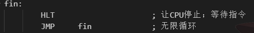

## TIME
{: id="20210307084617-8v957an" updated="20210307084624"}

2021-03-07 08:46 - 2021-03-07 10:10
{: id="20210307084624-kxo6zsq" updated="20210309132735"}

## ORG
{: id="20210307085616-x4j7zms" name="origin" updated="20210307093012"}

从指定地址开始执行程序
{: id="20210307093012-aw7nkdi" updated="20210307093050"}

`0x0007c00-0x0007dff`：**启动区内容的装载地址**
{: id="20210307093308-arjij1y" updated="20210307093330"}

## 寄存器
{: id="20210307093009-8kdx5r8" updated="20210307093009"}

**16**
{: id="20210307085623-qwuw77b" updated="20210307090337"}

AX—accwnulator, 累加寄存器
CX—counter, 计数寄存器
DX—data, 数据寄存器
VX—base, 基址寄存器
SP—stack pointer, 栈指针寄存器
BP—base pointer, 基址指针寄存器
SI—source index, 源变址寄存器
DX—destination index, 目的变址寄存器
{: id="20210307090336-wb8qxfo" updated="20210307090336"}

**8**
{: id="20210307085905-xjgsjuu" updated="20210307090332"}

AL—累加寄存器低位(accumulator low)
CL—计数寄存器低位(counter low)
DL—数据据寄存器低位(data low)
BL—基址寄存器低位(base low)
AH—累加寄存器高位(accumulator high)
CH—计数寄存器高位(counter high)
DH—数据寄存器高位(data high)
BH—基址寄存器高位(base high)
{: id="20210307085906-ymma4mk" updated="20210307090414"}

**32**
{: id="20210307090307-y4z02uv" updated="20210307090329"}

EAX, ECX, EDX, EBX, ESP, EBP, ESI, EDI
{: id="20210307090308-xjttbim" updated="20210307090328"}

**16-段**
{: id="20210307090414-uqj3x5z" updated="20210307090417"}

ES—附加段寄存器(extra segment)
CS—代码段寄存器(code segment)
SS—栈段寄存器(stack segment)
DS—数据段寄存器(data segment)
FS—没有名称(segment part 2)
GS—没有名称(segment part 3)
{: id="20210307090418-ydhe229" updated="20210307091615"}

**CAUTION**
{: id="20210307091616-u7pu55i" updated="20210307091621"}

只有BX、BP、SI、DI这几个寄存器可以用来指定内存地址，即可以使用`[BX]`取址(也可表示为`(BX)`)
{: id="20210307091623-zrh9z7w" updated="20210307091756"}

## 标号
{: id="20210307090409-dl5bg25" updated="20210307090542"}

**标号对应的数字**即是的**标号的位置对应的内存地址**，是汇编语言根据ORG指令计算出来的。
{: id="20210307090543-wzzg5zw" updated="20210307090631"}

## INT - 中断
{: id="20210307092037-ja7ec3o" updated="20210308185230"}

调用BIOS的函数，只有INT时中断
{: id="20210307092039-i1m9lh0" updated="20210308185219"}

## BIOS
{: id="20210307090550-zgo6fxl" alias="basic input output system" updated="20210307092139"}

程序名，出厂时组装于主板上的ROM单元中。写入了操作系统开发人员常用的一些程序。
{: id="20210307092140-jbkmeuy" updated="20210307092214"}

## CMP、JE
{: id="20210307092439-bzv090v" alias="halt" updated="20210308184947"}

```
CMP A, B
JE xxx
```
{: id="20210308184941-5hb9pzl" updated="20210308185111"}

`if(A == B) goto xxx;`
{: id="20210308185002-x7stphj" updated="20210308185116"}

## HLT
{: id="20210308184936-y7zgael" updated="20210308184936"}

让CPU进入停止待机状态，在外部发生变化后(按下键盘、移动鼠标)醒过来继续执行程序。
{: id="20210307092447-iwrio9e" updated="20210307092551"}

**省电模式的待机**
{: id="20210307092707-xq6hy2k" updated="20210307092715"}


{: id="20210307092630-va4s59h" updated="20210307092704"}

## Makefile基础
{: id="20210307092704-hjpnlm8" updated="20210307095218"}

### 文件生成规则
{: id="20210307095218-8jbjald" updated="20210307095305"}

`ipl.bin : ipl.nas Makefile`
{: id="20210307095301-nyvew9t" updated="20210307095301"}

**制作ipl.bin的方法**：
{: id="20210307095242-l5f698l" updated="20210307095344"}

1. {: id="20210307095641-lgsw67s"}如果ipl.bin不存在，ipl.nas存在，则开始制作ipl.bin(执行下一行开始所包括的内容)。
   {: id="20210307095641-uidn23x" updated="20210307100014"}
{: id="20210307095518-yiac1ez" updated="20210307095641"}

2. {: id="20210307095644-ft7mddl"}如果ipl.bin、ipl.nas不存在，则搜索制作ipl.nas的方法，搜索不到则报错；搜索到则开始制作ipl.bin，后制作ipl.bin。
   {: id="20210307095644-4du20v7" updated="20210307095651"}
{: id="20210307095345-k7l0gb3" updated="20210307095644"}

3. {: id="20210307095647-q8sxq4b"}如果ipl.bin、ipl.nas存在，则尝试制作ipl.bin，与现有文件比较，如有不同之处则使用新的，否则提示up to date。
   {: id="20210307095647-jbmfp40" updated="20210307095650"}
{: id="20210307095635-2zirrul" updated="20210307095647"}

4. {: id="20210307095649-tx2zx4o"}如果ipl.bin存在，ipl.nas不存在，则做搜索方法同上。
   {: id="20210307095649-6fl9sya" updated="20210307095728"}
{: id="20210307095346-inqj2up" updated="20210307095649"}

- {: id="20210307095729-61ytcnx"}如果是a.xxx : b.xxx c.xxx d.xxx Makefile的格式，则a.xxx的前提文件有b.xxx、c.xxx、d.xxx三个。
  {: id="20210307095729-gx3o70t" updated="20210307095831"}
{: id="20210307095728-ngml3a6" updated="20210307095729"}

### 命令
{: id="20210307095532-mfnajir" updated="20210307095929"}

`img :`
{: id="20210307095929-c5123hj" updated="20210307095938"}

当命令行输入`make img`的时候，执行下一行开始所包括的内容。
{: id="20210307095715-aq6but8" updated="20210307100017"}


{: id="20210307084617-zdc6qn5" type="doc"}
