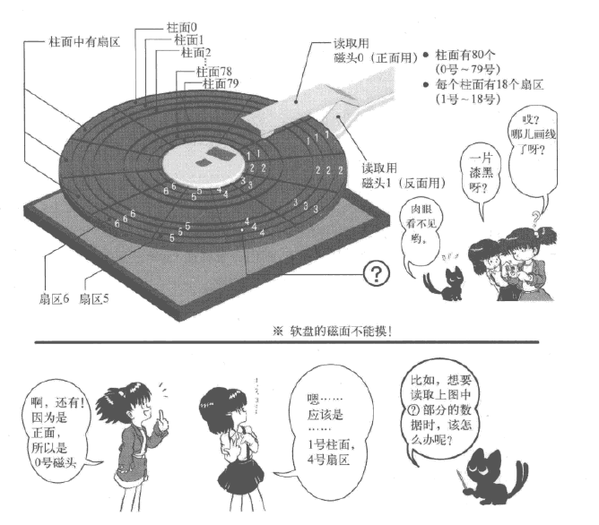

## TIME
{: id="20210308183936-e8xhpmw" updated="20210308183941"}

2021-3-8 18:46
{: id="20210308183942-qjfr50l" updated="20210308184703"}

## JC
{: id="20210308184704-k8nvj92" updated="20210308184709"}

女子初中生(雾)
{: id="20210308184709-dwdk9ub" updated="20210308184726"}

其实是jump if carry的缩写，进位标志位(CF)为1即跳转。
{: id="20210308184727-gp1hmlo" updated="20210308185606"}

## INT - 0x13
{: id="20210308184747-34poqcz" updated="20210308185235"}

■ AH=Ox02; (读盘）
■ AH=Ox.03; (写盘）
■ AH=Ox04; (校验）
■ AH=OxOc; (寻道）
■ AL=处理对象的扇区数；（只能同时处理连续的扇区）
■ CH=柱面号&Oxff;
■ CL=扇区号(0-5位） | （柱面号&0x300）»2;
■ DH=磁头号；
■ DL=驱动器号；
■ ES :BX=缓冲地址；（校验及寻道时不使用）
• 返回值：
■ FLAGS.CF==O: 没有错误， AH=O
■ FLAGS.CF= l : 有错误，错误号码存人AH内（与重置(reset) 功能一样）
{: id="20210308185232-cgrlbyr" updated="20210308185808"}

## 软盘、磁道、扇区、磁头
{: id="20210308190545-vz00dtj" updated="20210308190559"}

{: id="20210308185431-jdx634y" updated="20210308190543"}

## 段寄存器
{: id="20210308190600-xuyp4qj" updated="20210308191543"}

没有32位寄存器、且低位寄存器表示不了内存的时候，使用两个段寄存器来表示内存：
{: id="20210308190742-cp0ql30" updated="20210308190810"}

### ES:BX
{: id="20210308190810-w2d7tlr" updated="20210308191550"}

即可以表示`ES << 4 + BX`的地址
{: id="20210308191545-htc0krs" updated="20210308191545"}

### DS
{: id="20210308191022-4xxhc6q" updated="20210308191553"}

一般形式为(DS: num)或[DS: num]，而简化为(num)或[num]表示取址，意义为`DS + num`，因此DS一般为0。
{: id="20210308191553-h9flaef" updated="20210308191859"}

## JNC
{: id="20210308191645-sngkdv3" updated="20210308192157"}

Jump if not carry，进位标志为0跳转。
{: id="20210308192157-m0awpxo" updated="20210308192208"}

## JAE
{: id="20210308192208-2vidjgb" updated="20210308192210"}

Jump if above or equal，大于等于时跳转。
{: id="20210308192210-2qmk5ar" updated="20210308192226"}

## JBE
{: id="20210308192643-79u09ps" updated="20210308192646"}

Jump if below or equal，小于等于则跳转。
{: id="20210308192646-19l9yac" updated="20210308192657"}

## JB
{: id="20210308192700-gx5lxfe" updated="20210308193248"}

Jump if below，小于则跳转
{: id="20210308193248-4a2mdzr" updated="20210308193257"}

## abc EQU 123
{: id="20210308193304-85zboax" updated="20210308193407"}

相当于C中的`#define`，定义abc为常量123。
{: id="20210308193407-s59mptx" updated="20210308193431"}

## 向空软盘保存文件时
{: id="20210308193432-d0scaq4" updated="20210308194439"}

- {: id="20210308194442-os138ym"}文件名在0x002600之后的地方
  {: id="20210308194442-p13w7co" updated="20210308194452"}
- {: id="20210308194452-1e3j6sp"}文件内容会在0x004200之后的地方
  {: id="20210308194452-mpyt2g1" updated="20210308194500"}
{: id="20210308194440-l0pmgxw" updated="20210308194442"}

{: id="20210308194501-y8xkpwm"}

{: id="20210308183936-kybho3x" type="doc"}
