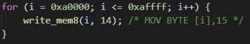
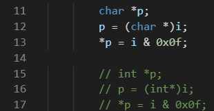

## TIME
{: id="20210309124559-xiqnlvc" updated="20210309124603"}

2021-03-09 12:46 -  2021-03-09 13:27
{: id="20210309124603-jlizhlt" updated="20210309132720"}

2021-03-09 16:05 - 2021-03-09 16:37
{: id="20210309155402-7vhpiyi" updated="20210309163705"}

## VRAM中屏幕各像素的地址
{: id="20210309124615-jorinwe" updated="20210309163106"}

((20210308194501-y8xkpwm "{{.text}}"))
{: id="20210309162811-mxt2bzk" updated="20210309162831"}

在`320 X 200 X 8位彩色模式，调色板模式`中，共`320 * 200 = 64000`个像素，设左上坐标为`(0, 0)`，则右下坐标为`(319, 199)`，则`(x, y)`的地址按如下计算：
{: id="20210309125603-9d9nbrt" updated="20210309163210"}

$$
0xa000 + x + y * 320
$$
{: id="20210309163210-ycf22nw" updated="20210309163241"}

向内存中这些位置存入0x0-0xe的数字，会显示各种颜色。
{: id="20210309163136-aq1et57" updated="20210309163145"}

**示例-黄色**
{: id="20210309125725-clvn4tl" updated="20210309125731"}


{: id="20210309125712-7g49s8m" updated="20210309125721"}

## 在C中直接访问地址
{: id="20210309124615-2hzu63m" updated="20210309130142"}

**当对非指针的变量使用\*运算符并试图赋值时会报错。**
{: id="20210309130142-xb1srwq" updated="20210309130755"}

**在C语言中直接向内存写入地址只能使用指针类型的变量。(也就是说得用指针声明，不能用变量声明)**
{: id="20210309130726-ip0mxgi" updated="20210309130811"}

`char *p;`表示BYTE地址
{: id="20210309130302-srt1xfm" updated="20210309130302"}

`short *p;`表示WORD地址
{: id="20210309130233-jjeaqic" updated="20210309130244"}

`int *p`表示DWORD地址
{: id="20210309130244-0z2o7tj" updated="20210309131046"}

**e.g：** 两种均可，其中第一种表意更加精确。
{: id="20210309131046-yevxj2u" updated="20210309131225"}


{: id="20210309131145-u4l20zz" updated="20210309131159"}

## 访问调色板
{: id="20210309131159-jlu6s14" updated="20210309160734"}

- {: id="20210309160737-2qqs44i"}调色板的访问步骤。
  {: id="20210309160740-6d10k2d"}
{: id="20210309160742-am07gvg"}

1. {: id="20210309160745-eyj6gue"}首先在一连串的访问中屏蔽中断（比如CLI）。
   {: id="20210309160745-s0mrzt8" updated="20210309160859"}
2. {: id="20210309160748-iddwnps"}将想要设定的调色板号码写入0x03c8, 紧接着，按R, G, B的顺序写人0x03c9。如果还
   想继续设定下一个调色板， 则省略调色板号码，再按照RGB的顺序写人0x03c9就行了。
   {: id="20210309160748-gjrzf6o" updated="20210309160812"}
3. {: id="20210309160754-8ue3deg"}如果想要读出当前调色板的状态，首先要将调色板的号码写人0x03c7, 再从0x03c9读取3
   次。读出的顺序就是R, G, B 。如果要继续读出下一个调色板，同样也是省略调色板号
   码的设定，按RGB的顺序读出。
   {: id="20210309160754-l1lkktc" updated="20210309160826"}
4. {: id="20210309160756-bna0kpy"}如果最初执行了CLI, 那么最后要执行STI。
   {: id="20210309160756-p2jbz5k" updated="20210309160756"}
{: id="20210309160740-27v84wh" updated="20210309160745"}

## CLI、STI
{: id="20210309161342-t1njptw" updated="20210309161348"}

**CLI**：设置标志位为0，忽略所有中断。
{: id="20210309161348-e65ywxj" updated="20210309161410"}

**STI**：设置标志位为1，开始接收中断。
{: id="20210309161410-3w3mfd1" updated="20210309161430"}

## PUSHFD、POPFD
{: id="20210309161751-salrbcl" updated="20210309161804"}

**PUSHFD**：push flags double-word，将标志位的值按双字(16 bits)长压入栈。
{: id="20210309161804-3qtfhmo" updated="20210309161909"}

**POPFD**：将EF FLAGS设置为栈中的值。
{: id="20210309161409-nqe2vvn" updated="20210309162142"}

```
PUSHFD
POP EAX
; 相反
PUSH EAX
POPFD
```
{: id="20210309162147-ywocvfy" updated="20210309162247"}

{: id="20210309162249-o3wdlk8"}


{: id="20210309124614-qj061ze" type="doc"}
