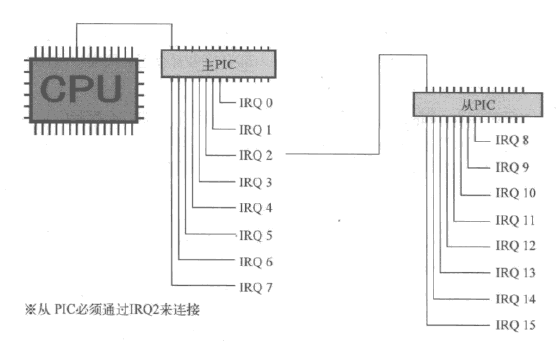

## TIME
{: id="20210311152323-rgqwzxp" updated="20210311152331"}

2021-03-11 15:23 -  2021-03-11 xx:xx
{: id="20210311152336-75a8iwm" updated="20210312094601"}

## Make 一般规则
{: id="20210311153110-q3tnozs" updated="20210311153119"}

`%.xxx(后缀名)，可以匹配任何具有该后缀名的文件。`
{: id="20210311153120-r0agsj2" updated="20210311153228"}

make.exe会首先寻找普通的生成规则，之后才会寻找一般的规则。
{: id="20210311153202-wn800ov" updated="20210311153652"}

## LGDT
{: id="20210311153228-ohytgl1" updated="20210311153650"}

((20210310074450-06ivfxr "{{.text}}"))
{: id="20210311153650-wjjt1ch" updated="20210311153709"}

((20210311153612-flkqiis "{{.text}}"))
{: id="20210311153705-q53nwkq" updated="20210311153705"}

指令，从给定的地址处取出 **6个字节** 赋值给GDTR。
{: id="20210311153658-2jcuhwl" updated="20210311153750"}

## LIDT
{: id="20210311154626-ff2rua6" updated="20210311154629"}

((20210310075623-dfb1em7 "{{.text}}"))
{: id="20210311154629-2p9jqw5" updated="20210311154644"}

((20210311154602-z9pu0ga "{{.text}}"))
{: id="20210311154646-l8fb0a6" updated="20210311154651"}

指令，从给定的地址处取出 **6个字节** 赋值给IDTR。
{: id="20210311154652-ujyk5i5" updated="20210311154700"}

## 段描述符
{: id="20210311154701-edsxzmd" updated="20210311155520"}

```C
struct SEGMENT_DESCRIPTOR {
	short limit_low, base_low;
	char base_mid, access_right;
	char limit_high, base_high;
};
```
{: id="20210311155520-xcxzp15" updated="20210311155542"}

一个段描述符分为三个部分：
{: id="20210311155546-sm2ck39" updated="20210311155601"}

- {: id="20210311155602-gw7u7c0"}段的基址 base
  {: id="20210311155602-7ncq9bs" updated="20210311155623"}
- {: id="20210311155608-jcdqouu"}段的界限（大小） limit
  {: id="20210311155608-ta6q65v" updated="20210311155625"}
- {: id="20210311155617-pxs709h"}段的属性（段访问权限） assess_right
  {: id="20210311155617-r1nc31u" updated="20210311160337"}
{: id="20210311155601-235ukx9" updated="20210311155602"}

在本程序中，基址被分为三部分存储（默认数字左高右低）；界限被分为两部分存储；属性也分为两部分存储；**其中limit_high存界限的前4位与属性前四位**。算法如图：
{: id="20210311155631-e3qsi9s" updated="20210311160347"}

```c
void set_gatedesc(struct GATE_DESCRIPTOR *gd, int offset, int selector, int ar)
{
	gd->offset_low   = offset & 0xffff;
	gd->selector     = selector;
	gd->dw_count     = (ar >> 8) & 0xff;
	gd->access_right = ar & 0xff;
	gd->offset_high  = (offset >> 16) & 0xffff;
	return;
}
```
{: id="20210311155832-yrzvirn" updated="20210311155833"}

因此，段界限20位，段基址32位，段属性12位。
{: id="20210311155820-px7gffl" updated="20210311160328"}

### 段属性
{: id="20210311160357-ltuow4f" updated="20210311160401"}

段属性其中前4位为扩展访问权，存在limit_high中，由GD(D为0表示16位模式，1表示32位模式)00构成。
{: id="20210311160141-b51c6o4" updated="20210311160325"}

段属性后8位为：
{: id="20210311160354-91stox6" updated="20210311160413"}

00000000 ( 0x00): 未使用的记录表(descriptor table)。
10010010 (0x92): 系统专用，可读写的段。不可执行。
10011010 (0x9a): 系统专用，可执行的段。可读不可写。
11110010 (0xf2): 应用程序用，可读写的段。不可执行。
11111010 (0xfa): 应用程序用，可执行的段。可读不可写。
{: id="20210311160414-zdkc8eb" updated="20210311160503"}

## PIC、可编程中断控制器
{: id="20210311160015-s9r2fko" updated="20210311160614"}

programmable interrupt controller、可编程中断控制器，将8个中断信号集合成1个中断信号。
{: id="20210311160546-tmfkblo" updated="20210311160657"}

PIC监视着输入管脚的8个中断信号，一旦一个信号进来，即将唯一的输出管脚信号变成ON，通知CPU。
{: id="20210311160657-uovm7fu" updated="20210311160748"}

### 主PIC master PIC、从PIC slave PIC
{: id="20210311160813-ufvsmis" updated="20210311160903"}

与CPU相连的PIC称主PIC、与主PIC相连的PIC称从PIC，主PIC负责处理0-7号中断信号，从PIC负责处理8-15号中断信号。
{: id="20210311160820-mjhpxcb" updated="20210311160946"}

~~这命名充满了英特尔大叔们SM的乐趣~~
{: id="20210311160950-0e3xxj6" updated="20210311161005"}


{: id="20210311161108-bvjjg4v" updated="20210311161115"}

## PIC寄存器
{: id="20210311161116-c6ggf3h" updated="20210311161433"}

((20210311160015-s9r2fko "{{.text}}"))
{: id="20210311161429-yfghu0p" updated="20210311161527"}

### IMR、中断屏蔽寄存器
{: id="20210311161524-9lazmcy" updated="20210311161524"}

interrupt mask register，8位寄存器，分别对应8路IRQ信号（见上图），某位为1视为屏蔽该信号。
{: id="20210311161453-rwzfgxs" updated="20210311161626"}

### ICW、初始化控制器
{: id="20210311161550-cl405of" updated="20210311161616"}

initial control word，**8位**寄存器（虽然是"word"，可在除CPU外的设备，"word"有时指8位，有时指32位），ICW有4个，编号1-4。
{: id="20210311161627-pql8k85" updated="20210311161820"}

#### ICW1、ICW4
{: id="20210311161814-kmvarnb" updated="20210311161932"}

与PIC主板配线方式、中断信号的电路特性有关，固定值。
{: id="20210311161933-fu0kuoc" updated="20210311161958"}

#### ICW3
{: id="20210311161959-wgj57hb" updated="20210311162003"}

有关主-从连接的设定，默认设定`0x00000100`，意思为第二号IRQ连接的是从PIC。**注意，ICW3不可更改，因为硬件已经决定好了。**
{: id="20210311162003-ylrmguq" updated="20210311162733"}

#### ICW2
{: id="20210311162105-yryjuaz" updated="20210311162109"}

决定IRQ以哪一号中断（哪一号中断指的是INT xx）通知CPU。
{: id="20210311162109-okb92us" updated="20210311162311"}

```c
void init_pic(void)
/* PIC设定 */
{
	io_out8(PIC0_IMR,  0xff  ); /* 屏蔽主PIC的所有IRQ */
	io_out8(PIC1_IMR,  0xff  ); /* 屏蔽从PIC的所有IRQ */

	io_out8(PIC0_ICW1, 0x11  ); /* 固定值 */
	io_out8(PIC0_ICW2, 0x20  ); /* IRQ0-7对应INT20-27*/
	io_out8(PIC0_ICW3, 1 << 2); /* PIC1的IRQ2连接PIC2 */
	io_out8(PIC0_ICW4, 0x01  ); /* 固定值 */

	io_out8(PIC1_ICW1, 0x11  ); /* 固定值 */
	io_out8(PIC1_ICW2, 0x28  ); /* IRQ8-15对应INT28-2f */
	io_out8(PIC1_ICW3, 2     ); /*  */
	io_out8(PIC1_ICW4, 0x01  ); /* 固定值 */

	io_out8(PIC0_IMR,  0xfb  ); /* 屏蔽主PIC除连接从PIC的IRQ外的所有IRQ */
	io_out8(PIC1_IMR,  0xff  ); /* 屏蔽从PIC的所有IRQ */

	return;
}
```
{: id="20210311163002-h70gxhm" updated="20210311163005"}

### CPU与PIC通信的具体细节
{: id="20210311162312-fpo49c7" updated="20210311163142"}

中断发生以后，如果CPU可以受理这个中断，CPU就会命令PIC发送2个字节的数据。
{: id="20210311163143-5r78hh2" updated="20210311163315"}

CPU与PIC用IN或OUT进行数据传送时，有数据信号线连在一起。PIC就是利用这个信号线发送这2个字节数据的。送过来的数据是"`0xcd 0x??`"这两个宇节。由于电路设计的原因，这两个字节的数据在CPU看来，与从内存读进来的程序是完全一样的，所以CPU就把送过来的"`0xcd 0x??`"作为机器语言执行。这恰恰就是把数据当作程序来执行的情况。
{: id="20210311163316-92old85" updated="20210311163414"}

这里的0xcd就是调用BIOS时使用的INT指令。我们在程序里写的"`INT 0x10`", 最后就被编译成了"`0xcd 0x10`" 。所以， CPU上了PIC的当，按照PIC所希望的中断号执行了INT指令。
{: id="20210311163416-63wk8pb" updated="20210311163448"}

## IRETD
{: id="20210311163648-uuxay1x" updated="20210311163659"}

中断完成，执行return后并没有跳回用户态，需要使用此条汇编指令跳回用户态。
{: id="20210311163659-2pz830o" updated="20210311163738"}

## PUSHAD
{: id="20210311163739-2rf6ast" updated="20210311163930"}

相当于将EAX、ECX、EDX、EBX、ESP、EBP、ESI、EDI全部push进栈中。
{: id="20210311163930-ygug49j" updated="20210311165132"}

{: id="20210311165032-0wo2y8u"}

{: id="20210311164006-aiczl5r"}

{: id="20210311163452-dl07mmt"}

{: id="20210311161440-j397v7l"}


{: id="20210311152323-az6bab2" type="doc"}
