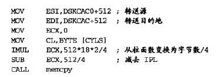

## TIME
{: id="20210312215419-yr7f0x7" updated="20210312215425"}

2021-03-12 09:54 -  2021-03-12 23:04
{: id="20210312215425-z600t32" updated="20210312230414"}

## STIHLT
{: id="20210312215449-mqlhc23" updated="20210312221218"}

((20210309161342-t1njptw "{{.text}}"))
{: id="20210312221132-anuccp2" updated="20210312221148"}

((20210308184936-y7zgael "{{.text}}"))
{: id="20210312221203-bkae1t9" updated="20210312221209"}

STI指令与HLT指令不能分开执行，否则会导致临界区被访问。
{: id="20210312221056-d3asgvb" updated="20210312221247"}

## 初始化PIC
{: id="20210312221248-speabr9" updated="20210312224124"}

((20210311160015-s9r2fko "{{.text}}"))
{: id="20210312224124-5x1u5t6" updated="20210312224143"}

((20210309161342-t1njptw "{{.text}}"))
{: id="20210312224146-2wh63gi" updated="20210312224149"}

初始化PIC必须要在CLI指令之前进行，否则程序有时会挂起。
{: id="20210312224141-m4axc6x" updated="20210312224204"}

## NOP
{: id="20210312224205-oo48rxz" updated="20210312224246"}

什么也不做，让CPU休息一个时钟长的时间，
{: id="20210312224246-cn91km3" updated="20210312224302"}

## A20GATE
{: id="20210312224302-tgqnwul" updated="20210312224617"}

当A20GATE变为ON的状态时，可以使内存的1MB以上部分变为可使用状态。
{: id="20210312224618-k2qcz5x" updated="20210312224715"}

## 保护模式
{: id="20210312224715-kc83ykn" updated="20210312224946"}

在这种模式下，应用程序不能随意更改段的设定，也不能更改操作系统专用的段，操作系统受到CPU的保护。
{: id="20210312224938-1w9lm31" updated="20210312225018"}

### CR0、开启保护模式
{: id="20210312225019-ifiii54" updated="20210312225047"}

CR0寄存器、control register 0，只有操作系统可以操作。
{: id="20210312225051-gp3mkv7" updated="20210312225112"}

将CR0寄存器最高位设0，最低位设1，即开启保护模式。
{: id="20210312225023-nt6iodp" updated="20210312225135"}

## MEMCPY
{: id="20210312225429-cg26yjc" updated="20210312225432"}

`memcpy(转送源地址、ESI, 转送目的地址、EDI, 转送数据的大小、ECX);`
{: id="20210312225432-iimctg1" updated="20210312225526"}

注意，转送数据的大小是以 **双字** 为单位的，因此需要 **$\div4$** 。
{: id="20210312225136-m4wzejc" updated="20210312225610"}

**e.g:**
{: id="20210312225613-9kutsz3" updated="20210312225616"}

{: id="20210312225616-5gex7a5" updated="20210312225918"}

## JZ、JNZ
{: id="20210312221149-i3duvqx" updated="20210312230056"}

**JZ**：jump if zero，条件跳转。
{: id="20210312225910-vjtoda2" updated="20210312230112"}

**JNZ** ：jump if not zero，条件跳转。
{: id="20210312230057-4akirhs" updated="20210312230121"}

## ALIGNB
{: id="20210312225922-88yibm4" updated="20210312230243"}

`ALIGNB x`
{: id="20210312230243-x8vff84" updated="20210312230254"}

((20210306165656-cjsi2vy "{{.text}}"))
{: id="20210312230309-g6hmob6" updated="20210312230312"}

一直添加`DB 0`，直到地址能被x整除的时候。
{: id="20210312230255-lrl7atf" updated="20210312230326"}

{: id="20210312215419-srzggbj" type="doc"}
